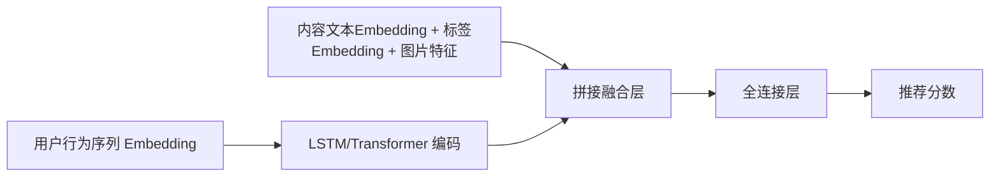
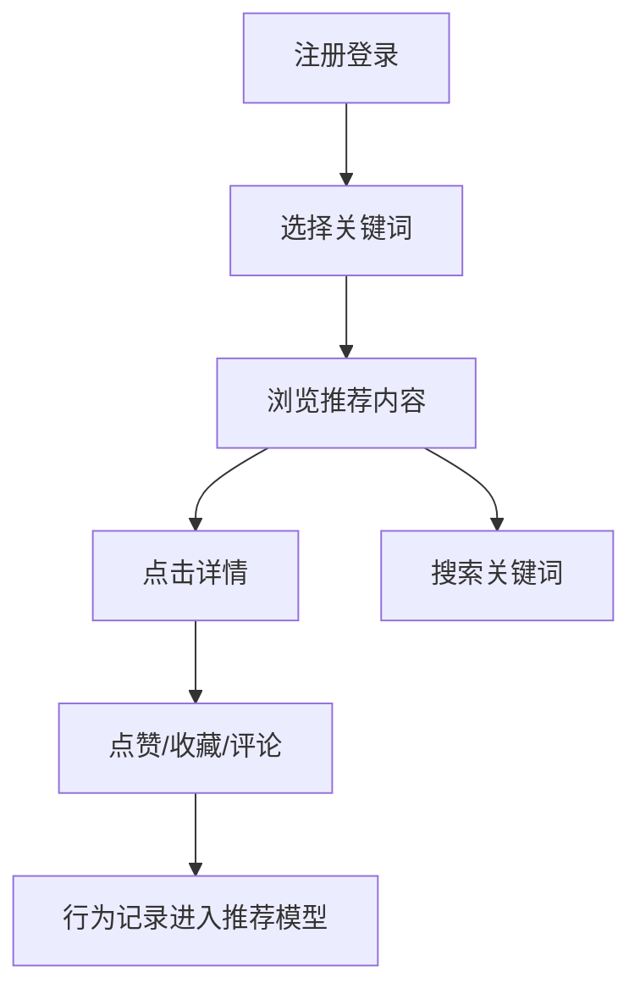

# 机器学习推荐知识APP产品需求文档

## 一、项目概述

### 1.1 项目名称
基于神经网络推荐算法的碎片化知识分享与个性化推荐平台

### 1.2 项目背景与目标
在当今信息爆炸的背景下，用户面临获取高质量知识内容的困难。本项目旨在打造一个以机器学习和神经网络为核心算法支持的推荐系统，模拟小红书式的图文知识分享与消费场景，实现内容的个性化精准推送。

---

## 二、核心功能模块

1. 用户注册 / 登录（含密码加密与身份验证）
2. 用户关键词兴趣管理
3. 内容发布（图文 + 标签）
4. 个性化推荐系统（神经网络推荐算法）
5. 内容点赞、收藏、评论等用户行为采集
6. 用户行为数据驱动推荐模型训练
7. 管理后台（简易审核、数据可视化）

---

## 三、数据库 ER 设计与字段定义

### 3.1 实体关系图（ER）

主要实体：
- User（用户）
- Content（内容）
- Tag（标签）
- UserBehavior（行为）
- Favorite（收藏）
- Comment（评论）

### 3.2 字段设计（简要）

#### users

| 字段名         | 类型      | 描述             |
|----------------|-----------|------------------|
| id             | int       | 主键，自增        |
| username       | varchar   | 用户名           |
| password_hash  | varchar   | 加密密码         |
| email          | varchar   | 邮箱             |
| created_at     | datetime  | 注册时间         |

#### contents

| 字段名         | 类型      | 描述               |
|----------------|-----------|--------------------|
| id             | int       | 主键，自增          |
| user_id        | int       | 外键，发布者        |
| title          | varchar   | 内容标题            |
| body           | text      | 内容正文            |
| image_url      | varchar   | 图片链接            |
| created_at     | datetime  | 发布时间            |

#### tags

| 字段名       | 类型      | 描述             |
|--------------|-----------|------------------|
| id           | int       | 主键，自增        |
| name         | varchar   | 标签名           |

#### content_tags

| 字段名       | 类型    | 描述               |
|--------------|---------|--------------------|
| id           | int     | 主键                |
| content_id   | int     | 外键，内容ID         |
| tag_id       | int     | 外键，标签ID         |

#### user_behaviors

| 字段名       | 类型    | 描述                        |
|--------------|---------|-----------------------------|
| id           | int     | 主键                        |
| user_id      | int     | 用户ID                      |
| content_id   | int     | 内容ID                      |
| behavior     | varchar | 行为类型（view, like, etc） |
| created_at   | datetime| 行为时间                    |

#### favorites

| 字段名       | 类型    | 描述     |
|--------------|---------|----------|
| id           | int     | 主键      |
| user_id      | int     | 用户ID    |
| content_id   | int     | 内容ID    |

#### comments

| 字段名       | 类型    | 描述     |
|--------------|---------|----------|
| id           | int     | 主键      |
| user_id      | int     | 用户ID    |
| content_id   | int     | 内容ID    |
| body         | text    | 评论内容   |
| created_at   | datetime| 评论时间   |

---

## 四、用户行为采集与特征工程设计

### 4.1 行为类型

- 浏览(view)
- 点赞(like)
- 收藏(favorite)
- 评论(comment)
- 标签选择(tag_click)
- 搜索行为(search_query)

### 4.2 特征设计（用于推荐模型）

| 特征类别         | 特征名称                     |
|------------------|------------------------------|
| 用户侧特征       | 用户ID、注册时间、活跃度、兴趣关键词 |
| 内容侧特征       | 内容ID、标签、文本Embedding、图片特征 |
| 行为序列特征     | 最近N条行为序列（内容ID+行为类型+时间） |
| 时间特征         | 行为发生时间、内容发布时间             |

---

## 五、推荐算法设计

### 5.1 模型结构（神经网络）



### 5.2 训练策略

| 项目 | 内容 |
|------|------|
| **损失函数** | 二分类交叉熵 + 排名损失（可选，如 BPR、pairwise loss） |
| **输入样本** | 用户历史行为 + 正样本（已点击） + 负采样内容（未点击） |
| **训练机制** | 初期离线训练为主；上线后每日增量数据周期性训练 |
| **模型更新** | 每日更新 Embedding，支持 Fine-tuning；后期考虑在线学习（Online Learning） |

---

## 六、API 接口文档（RESTful 风格）

### 6.1 获取推荐内容（GET）

- **URL**：`/api/recommendations`
- **请求参数**（JSON 格式）：

```json
{
  "user_id": 123,
  "keywords": ["神经网络", "NLP"],
  "limit": 20
}
```

* **响应示例**：

```json
{
  "user_id": 123,
  "recommendations": [
    {
      "content_id": 1,
      "title": "神经网络入门指南",
      "summary": "介绍神经网络基本结构与反向传播原理。",
      "image_url": "https://example.com/img1.jpg",
      "tags": ["神经网络", "机器学习"]
    }
  ]
}
```

---

## 七、前端交互与 UI 组件方案

### 7.1 核心页面与组件结构

| 页面        | 主要组件                   |
| --------- | ---------------------- |
| **首页**    | 推荐内容流、关键词选择器、搜索框       |
| **内容详情页** | 图文展示组件、点赞/评论/收藏按钮、相关推荐 |
| **用户主页**  | 用户行为统计、关键词管理、收藏内容列表    |

---

### 7.2 UI 组件设计风格

* **图文卡片样式**：内容以瀑布流或 Feed 流方式展示；
* **关键词标签展示**：使用圆角Tag、颜色区分标签种类；
* **交互按钮**：浮动式设计，支持点赞、收藏、评论；
* **移动端支持**：响应式布局适配主流手机屏幕；

---

## 八、用户故事与行为流程图

### 8.1 用户故事（User Story）

用户 A 是一位对「神经网络」感兴趣的大学生。他注册账号后，系统引导他选择兴趣关键词。在首页中他浏览了推荐内容，并收藏了几篇图文笔记。第二天再次打开 App，系统根据他的行为推荐了更多相关内容，并将其推荐列表不断优化。

---

### 8.2 用户行为流程图



---

## 九、开发技术栈建议

| 模块       | 技术栈                                      |
| -------- | ---------------------------------------- |
| **后端**   | Python、Django、Django REST Framework      |
| **推荐模型** | PyTorch / TensorFlow、scikit-learn、pandas |
| **数据库**  | PostgreSQL / MySQL                       |
| **前端**   | Vue.js 或 React（支持移动端响应式）                 |
| **部署**   | Docker + Gunicorn + Nginx；可部署至阿里云 / 腾讯云等 |

---

## 十、未来拓展方向（可选）

* 支持用户关注与私信功能，形成知识圈子
* 增加视频内容支持（嵌入 Bilibili、YouTube 教学）
* 多语言内容支持（中英双语、日语等）
* 模型 A/B 测试平台集成，测试推荐效果变化
